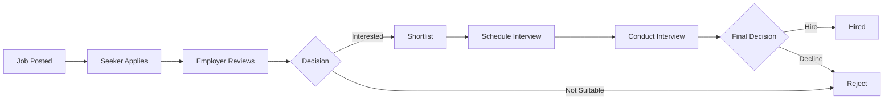

# 💼 Job Connect - Professional Job Marketplace Platform

<div align="center">


**A modern, full-featured job marketplace connecting talented job seekers with top employers through real-time communication and intelligent matching.**

[Features](#-features) • [Screenshots](#-screenshots) • [Installation](#-installation) • [Usage](#-usage) • [Tech Stack](#-tech-stack)

</div>

---

## 🌟 Features

### For Job Seekers
- 🔍 **Advanced Job Search** - Filter by location, category, salary, and experience level
- 📝 **Easy Applications** - Apply with one click using your saved profile and resume
- 💾 **Save Jobs** - Bookmark interesting positions for later review
- 💬 **Real-time Chat** - Message employers directly with instant WebSocket communication
- 📊 **Application Tracking** - Monitor your application status in real-time
- 👤 **Professional Profiles** - Showcase skills, experience, education, and portfolio
- 📄 **Resume Management** - Upload and manage multiple resume versions

### For Employers
- 📢 **Job Posting** - Create and manage job listings with rich descriptions
- 👥 **Applicant Management** - Review, filter, and track all applications
- ✅ **Application Status** - Update candidates with Pending, Reviewed, Shortlisted, or Rejected status
- 💬 **Direct Messaging** - Chat with candidates in real-time
- 📅 **Interview Scheduling** - Schedule and manage video interviews
- 🎥 **Video Interviews** - Conduct remote interviews with integrated video calling
- 📈 **Analytics Dashboard** - Track job performance and application metrics

### Platform Features
- 🔐 **Secure Authentication** - Role-based access control (Job Seeker / Employer)
- ⚡ **Real-time Messaging** - WebSocket-powered chat with message persistence
- 🎨 **Modern UI/UX** - Professional, responsive design with smooth animations
- 📱 **Mobile Responsive** - Optimized for all devices and screen sizes
- 🔔 **Notifications** - Stay updated on applications and messages
- 🌐 **RESTful Architecture** - Clean, maintainable codebase

---

## 🚀 Quick Start

### Prerequisites

- Python 3.8 or higher
- pip (Python package manager)
- Virtual environment (recommended)

### Installation

1. **Clone the repository**
   ```bash
    git clone https://github.com/salamlakhan7/Job-connect-Full-stack.git
    cd Job-connect-Full-stack

   ```

2. **Create and activate virtual environment**
   ```bash
   # Windows
   python -m venv venv
   venv\Scripts\activate

   # macOS/Linux
   python3 -m venv venv
   source venv/bin/activate
   ```

3. **Install dependencies**
   ```bash
   pip install -r requirements.txt
   ```

4. **Run database migrations**
   ```bash
   python manage.py makemigrations
   python manage.py migrate
   ```

5. **Create a superuser (admin)**
   ```bash
   python manage.py createsuperuser
   ```

6. **Collect static files**
   ```bash
   python manage.py collectstatic --noinput

   ```

7. **Run the development server with WebSocket support**
   ```bash
   daphne -b 127.0.0.1 -p 8000 mysite.asgi:application
   ```

8. **Access the application**
   - Main site: `http://127.0.0.1:8000`
   - Admin panel: `http://127.0.0.1:8000/admin`

> **⚠️ Important:** Always use `daphne` to run the server (not `python manage.py runserver`) to enable WebSocket support for real-time chat functionality.

---

## 📖 Usage Guide

### For Job Seekers

1. **Register** - Click "Find a Job" and create your account
2. **Complete Profile** - Add your skills, experience, and upload your resume
3. **Search Jobs** - Browse available positions or use advanced filters
4. **Apply** - Submit applications with one click
5. **Chat** - Message employers directly about opportunities
6. **Track** - Monitor your application status in real-time

### For Employers

1. **Register** - Click "Post a Job" and create your employer account
2. **Post Jobs** - Create detailed job listings with requirements
3. **Review Applications** - View and filter candidate applications
4. **Manage Status** - Update application status (Pending → Reviewed → Shortlisted → Hired)
5. **Chat** - Communicate with candidates in real-time
6. **Schedule Interviews** - Set up video interviews with shortlisted candidates

---

## 🛠️ Tech Stack

### Backend
- **Django 5.2.8** - High-level Python web framework
- **Django Channels 4.3.2** - WebSocket support for real-time features
- **Daphne 4.2.1** - ASGI server for WebSocket handling
- **SQLite** - Database (development) , SQLite is used for local development. PostgreSQL is recommended for production.

### Frontend
- **HTML5 & CSS3** - Structure and styling
- **Tailwind CSS** - Utility-first CSS framework
- **JavaScript (ES6+)** - Interactive functionality
- **WebSocket API** - Real-time communication

### Key Features
- **WebSocket Communication** - Real-time chat with message persistence
- **ASGI Application** - Asynchronous server gateway interface
- **Channel Layers** - In-memory channel layer for WebSocket routing
- **File Upload** - Resume and document management
- **Authentication** - Django's built-in auth system with role-based access

---

## 📁 Project Structure

```
Job-connect-sindhi/
├── jobs/                          # Main application
│   ├── templates/                 # HTML templates
│   │   ├── employer/             # Employer-specific templates
│   │   │   ├── chat_room.html   # Real-time chat interface
│   │   │   ├── chat_list.html   # Conversation list
│   │   │   └── ...
│   │   ├── seeker/               # Job seeker templates
│   │   └── ...
│   ├── static/                    # Static files (CSS, JS, images)
│   ├── models.py                  # Database models
│   ├── views.py                   # View functions
│   ├── urls.py                    # URL routing
│   ├── consumers.py               # WebSocket consumers
│   ├── routing.py                 # WebSocket routing
│   └── forms.py                   # Django forms
├── mysite/                        # Project configuration
│   ├── settings.py               # Django settings
│   ├── urls.py                   # Main URL configuration
│   ├── asgi.py                   # ASGI configuration
│   └── wsgi.py                   # WSGI configuration
├── media/                         # User-uploaded files
├── staticfiles/                   # Collected static files
├── Page Screenshot/               # Application screenshots
├── requirements.txt               # Python dependencies
├── manage.py                      # Django management script
└── README.md                      # This file
```

---

## 🔧 Configuration

### Environment Variables (Optional)

Create a `.env` file in the project root:

```env
DEBUG=True
SECRET_KEY=your-secret-key-here
ALLOWED_HOSTS=localhost,127.0.0.1
DATABASE_URL=sqlite:///db.sqlite3
```

### Channel Layers

The application uses **InMemoryChannelLayer** for development. For production, configure Redis:

```python
# settings.py
CHANNEL_LAYERS = {
    "default": {
        "BACKEND": "channels_redis.core.RedisChannelLayer",
        "CONFIG": {
            "hosts": [("127.0.0.1", 6379)],
        },
    },
}
```

---

## 🎨 Features in Detail

### Real-time Chat System

The chat system features:
- ✅ **WebSocket Communication** - Instant message delivery
- ✅ **Message Persistence** - All chats saved to database
- ✅ **Typing Indicators** - See when someone is typing
- ✅ **Online Status** - Real-time presence indicators
- ✅ **File Attachments** - Share documents and images
- ✅ **Professional UI** - Gradient design with smooth animations
- ✅ **Message History** - Access past conversations anytime

### Application Workflow


   If the diagram doesn’t render, view on GitHub desktop or browser.
---

## 🧪 Testing

Run tests with:

```bash
python manage.py test
```

---

## 🤝 Contributing

Contributions are welcome! Please follow these steps:

1. Fork the repository
2. Create a feature branch (`git checkout -b feature/AmazingFeature`)
3. Commit your changes (`git commit -m 'Add some AmazingFeature'`)
4. Push to the branch (`git push origin feature/AmazingFeature`)
5. Open a Pull Request

---

## 📝 License

This project is licensed under the MIT License - see the [LICENSE](LICENSE) file for details.

---

## 👥 Authors

- **Abdul Salam** - *Initial work* - [YourGitHub](https://github.com/salamlakhan7)

---

## 🙏 Acknowledgments

- Django community for excellent documentation
- Tailwind CSS for the utility-first CSS framework
- Django Channels for WebSocket support
- All contributors and testers

---

## 📞 Support

For support, email salamlakhan7@gmail.com or open an issue in the repository.

---

## 🗺️ Roadmap

- [ ] Email notifications for new applications
- [ ] Advanced analytics dashboard
- [ ] Resume parsing with AI
- [ ] Job recommendation algorithm
- [ ] Mobile app (React Native)
- [ ] Multi-language support
- [ ] Payment integration for premium features
- [ ] Company verification system

---

<div align="center">

**Made with ❤️ using Django**

⭐ Star this repo if you find it helpful!

</div>
