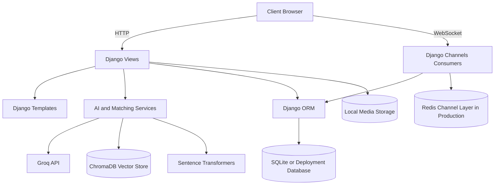
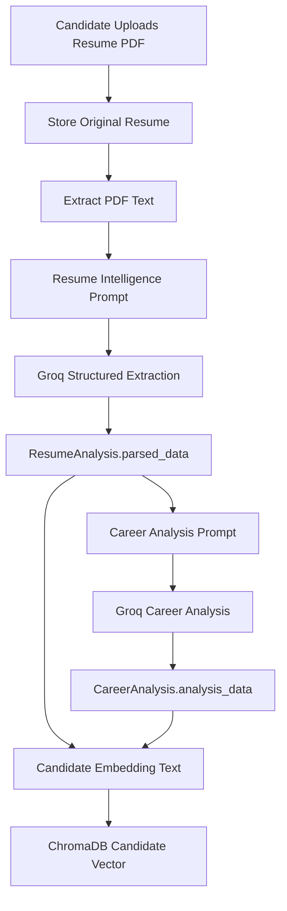
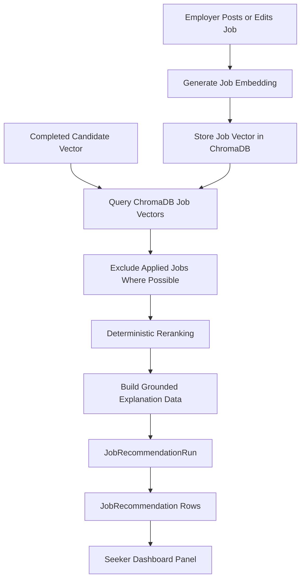

# Job Connect AI


Job Connect AI is a Django-based job marketplace that connects candidates and employers with authentication, dashboards, job posting, applications, resume upload, real-time chat, and AI-powered career intelligence.

The platform has evolved from a traditional job board into an AI-assisted hiring product. Candidates can upload resumes, receive structured resume analysis, view career readiness insights, generate embeddings, and receive semantic job recommendations powered by ChromaDB and Sentence Transformers.

## Table of Contents

- [Key Features](#key-features)
- [AI Features](#ai-features)
- [Technology Stack](#technology-stack)
- [System Architecture](#system-architecture)
- [AI Pipeline](#ai-pipeline)
- [Installation Guide](#installation-guide)
- [Environment Variables](#environment-variables)
- [Local Development](#local-development)
- [Running the Project](#running-the-project)
- [Project Structure](#project-structure)
- [API Overview](#api-overview)
- [Screenshots](#screenshots)
- [Repository Metadata Suggestions](#repository-metadata-suggestions)
- [Future Roadmap](#future-roadmap)
- [Contributing](#contributing)
- [License](#license)

## Key Features

- Role-based authentication for candidates and employers.
- Candidate dashboard, profile management, resume upload, saved jobs, and applications.
- Employer dashboard, job posting, job editing, applicant review, and interview scheduling.
- Application status tracking.
- WebSocket chat with persisted conversations and file attachments.
- Media handling for resumes, profile images, and chat uploads.
- Django admin support with Jazzmin styling.
- Railway-ready deployment configuration.

## AI Features

- Resume Intelligence: extracts PDF text and converts resumes into structured JSON with Groq.
- Career Analysis: evaluates resume quality, ATS readiness, career readiness, weak sections, suggested improvements, and career paths.
- Embedding Infrastructure: generates candidate and job embeddings with `all-MiniLM-L6-v2`.
- Vector Store: stores vectors in ChromaDB while Django stores only embedding metadata.
- Semantic Job Matching: recommends jobs using ChromaDB similarity plus deterministic reranking.
- Explainable Recommendations: returns matched skills, missing skills, score breakdown, confidence, and next steps.

## Technology Stack

| Area | Technologies |
| --- | --- |
| Backend | Python, Django, Django Channels, Daphne, ASGI |
| API Style | Django session-authenticated views and JSON endpoints; DRF-compatible route documentation |
| Database | SQLite for local development, `dj-database-url` for deployment database configuration |
| AI | Groq, `pypdf`, Sentence Transformers, ChromaDB |
| Frontend | Django templates, HTML, CSS, JavaScript |
| Realtime | WebSockets through Django Channels |
| Deployment | Railway, WhiteNoise, Gunicorn/Uvicorn/Daphne dependencies, Redis channel layer support |

## System Architecture

Job Connect AI uses a conventional Django monolith with service-layer boundaries for AI and vector operations.


```mermaid
flowchart TD
    Browser[Client Browser] -->|HTTP| Views[Django Views]
    Browser -->|WebSocket| Channels[Django Channels Consumers]

    Views --> Templates[Django Templates]
    Views --> Services[AI and Matching Services]
    Views --> ORM[Django ORM]
    Channels --> ORM

    ORM --> DB[(SQLite or Deployment Database)]
    Services --> Groq[Groq API]
    Services --> Chroma[(ChromaDB Vector Store)]
    Services --> Embeddings[Sentence Transformers]
    Channels --> Redis[(Redis Channel Layer in Production)]
    Views --> Media[(Local Media Storage)]
```

Business logic for AI features is intentionally kept out of views and placed in `jobs/services/`.

For a deeper architecture explanation, see [docs/architecture.md](docs/architecture.md).

## AI Pipeline


```mermaid
flowchart TD
    Upload[Candidate Uploads Resume PDF] --> Store[Store Original Resume]
    Store --> Extract[Extract PDF Text]
    Extract --> ResumePrompt[Resume Intelligence Prompt]
    ResumePrompt --> GroqResume[Groq Structured Extraction]
    GroqResume --> ResumeAnalysis[ResumeAnalysis.parsed_data]
    ResumeAnalysis --> CareerPrompt[Career Analysis Prompt]
    CareerPrompt --> GroqCareer[Groq Career Analysis]
    GroqCareer --> CareerAnalysis[CareerAnalysis.analysis_data]
    ResumeAnalysis --> CandidateEmbedding[Candidate Embedding Text]
    CareerAnalysis --> CandidateEmbedding
    CandidateEmbedding --> CandidateVector[ChromaDB Candidate Vector]
```

The AI pipeline is designed to preserve the existing upload flow. Missing AI configuration should fail analysis safely without blocking resume storage.

## Semantic Job Matching Pipeline


```mermaid
flowchart TD
    JobPost[Employer Posts or Edits Job] --> JobEmbedding[Generate Job Embedding]
    JobEmbedding --> JobVector[Store Job Vector in ChromaDB]

    CandidateVector[Completed Candidate Vector] --> Query[Query ChromaDB Job Vectors]
    JobVector --> Query
    Query --> Exclude[Exclude Applied Jobs Where Possible]
    Exclude --> Score[Deterministic Reranking]
    Score --> Explain[Build Grounded Explanation Data]
    Explain --> Run[JobRecommendationRun]
    Run --> Rows[JobRecommendation Rows]
    Rows --> Dashboard[Seeker Dashboard Panel]
```

Final score weighting:

| Signal | Weight |
| --- | ---: |
| Semantic similarity | 45% |
| Skill match | 30% |
| Career readiness | 15% |
| ATS score | 10% |

The LLM does not decide final recommendation ranking.

## Installation Guide

### Prerequisites

- Python 3.10 or newer recommended.
- Git.
- Virtual environment support.
- Optional: Redis for production-style WebSocket testing.

### Clone

```bash
git clone https://github.com/salamlakhan7/Job-connect-Full-stack.git
cd Job-connect-Full-stack
```

### Create a Virtual Environment

Windows:

```bash
python -m venv venv
venv\Scripts\activate
```

macOS/Linux:

```bash
python3 -m venv venv
source venv/bin/activate
```

### Install Dependencies

```bash
pip install -r requirements.txt
```

### Apply Migrations

```bash
python manage.py migrate
```

### Create an Admin User

```bash
python manage.py createsuperuser
```

## Environment Variables

Create a `.env` file or configure these variables in your host platform.

| Variable | Required | Default | Purpose |
| --- | --- | --- | --- |
| `SECRET_KEY` | Production: yes | Development fallback in settings | Django signing key |
| `DEBUG` | No | `True` | Enables development behavior |
| `DATABASE_URL` | No | SQLite database | Deployment database connection |
| `REDIS_URL` | Production WebSockets | `redis://localhost:6379` | Redis channel layer when `DEBUG=False` |
| `GROQ_API_KEY` | For AI analysis | Empty | Enables Groq resume and career analysis |
| `GROQ_MODEL` | No | `llama-3.1-8b-instant` | Groq model name |
| `EMBEDDING_MODEL` | No | `all-MiniLM-L6-v2` | Sentence Transformer model |
| `CHROMA_DB_PATH` | No | `./chroma_db` | ChromaDB persistent storage path |

If `GROQ_API_KEY` is missing, resume upload should still work. AI analysis records fail safely.

## Local Development

Run Django checks:

```bash
python manage.py check
```

Run migrations:

```bash
python manage.py migrate
```

Run tests:

```bash
python manage.py test
```

Use Daphne when testing WebSocket chat:

```bash
daphne -b 127.0.0.1 -p 8000 mysite.asgi:application
```

Open:

```text
http://127.0.0.1:8000/
```

## Running the Project

For basic HTTP development:

```bash
python manage.py runserver
```

For the full app including WebSocket chat:

```bash
daphne -b 127.0.0.1 -p 8000 mysite.asgi:application
```

Static files:

```bash
python manage.py collectstatic --noinput
```

## Project Structure

```text
.
├── jobs/
│   ├── consumers.py              # WebSocket chat consumer
│   ├── decorators.py             # Role-based access decorators
│   ├── forms.py                  # Django forms
│   ├── models.py                 # Core marketplace and AI models
│   ├── routing.py                # Channels WebSocket routes
│   ├── services/
│   │   ├── resume_parser.py
│   │   ├── resume_analysis.py
│   │   ├── resume_prompts.py
│   │   ├── career_analysis.py
│   │   ├── career_prompts.py
│   │   ├── career_scoring.py
│   │   ├── groq_client.py
│   │   ├── embedding_client.py
│   │   ├── candidate_embedding.py
│   │   ├── job_embedding.py
│   │   ├── vector_store.py
│   │   ├── job_matching.py
│   │   └── recommendation_explanations.py
│   ├── templates/                # Django templates
│   ├── urls.py                   # App routes
│   └── views.py                  # Page and JSON views
├── mysite/
│   ├── asgi.py
│   ├── settings.py
│   ├── urls.py
│   └── wsgi.py
├── docs/
│   ├── architecture.md
│   ├── api.md
│   └── deployment.md
├── media/                        # Local uploads, ignored by Git
├── staticfiles/                  # Collected static files, ignored by Git
├── chroma_db/                    # Local vector store, ignored by Git
├── manage.py
├── requirements.txt
└── README.md
```

## API Overview

Most routes are session-authenticated Django endpoints. JSON endpoints are protected by login and role checks.

| Area | Endpoints |
| --- | --- |
| Authentication | `GET|POST /login/`, `GET /logout/` |
| Dashboards | `GET /dashboard/`, `GET /seeker/dashboard/`, `GET /employer/dashboard/` |
| Resume Analysis | `GET /seeker/profile/resume-analysis/` |
| Career Analysis | `GET /seeker/profile/career-analysis/`, `POST /seeker/profile/career-analysis/refresh/` |
| Recommendations | `GET /seeker/jobs/recommendations/`, `POST /seeker/jobs/recommendations/refresh/`, `GET /seeker/jobs/recommendations/<recommendation_id>/` |
| Jobs | `GET /jobs/all/`, `GET /jobs/search/`, `GET /job/<job_id>/` |
| Applications | `GET|POST /job/<job_id>/apply/`, `GET /seeker/applications/` |
| Employer Jobs | `GET /employer/jobs/`, `GET|POST /employer/job/post/`, `GET|POST /employer/job/<job_id>/edit/` |
| Chat | `GET /chat/`, `GET /chat/start/<application_id>/`, `GET /chat/<conversation_id>/`, `POST /chat/upload/` |

See [docs/api.md](docs/api.md) for fuller endpoint notes and example payloads.

## Screenshots

Screenshots should be added when the UI is finalized. Suggested image paths are included below so future updates can drop images into `docs/images/` without changing the section structure.

### Landing Page

```md

```

Placeholder: add a screenshot of the public landing page.

### Resume Upload

```md

```

Placeholder: add a screenshot of candidate resume upload and profile area.

### Career Analysis

```md

```

Placeholder: add a screenshot of the Career Intelligence panel.

### AI Recommended Jobs

```md

```

Placeholder: add a screenshot of semantic job recommendations on the seeker dashboard.

## Repository Metadata Suggestions

Suggested GitHub description, 160 characters or fewer:

```text
AI-powered Django job marketplace with resume intelligence, career analysis, ChromaDB embeddings, semantic job matching, and real-time chat.
```

Suggested GitHub topics:

```text
django, python, job-board, ai, groq, chromadb, sentence-transformers, semantic-search, job-matching, websockets, django-channels, resume-parser, career-analysis, railway
```

## Future Roadmap

- Background AI processing with Celery and Redis.
- Embedding and recommendation management commands.
- Explicit Chroma distance metric configuration.
- Recommendation caching and refresh policies.
- Skill synonym normalization.
- Semantic job search.
- AI cover letter generation.
- Interview preparation assistant.
- Employer-side AI candidate ranking.
- Resume improvement assistant.
- Expanded automated test coverage.

## Contributing

1. Fork the repository.
2. Create a feature branch.
3. Keep changes scoped and avoid unrelated refactors.
4. Run `python manage.py check` and `python manage.py test`.
5. Open a pull request with a clear summary and verification notes.

## License

No license file is currently included in this repository. Add a license before distributing or reusing this project outside the repository owner's intended scope.
