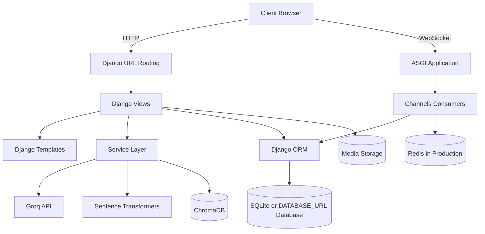
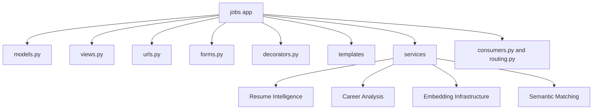
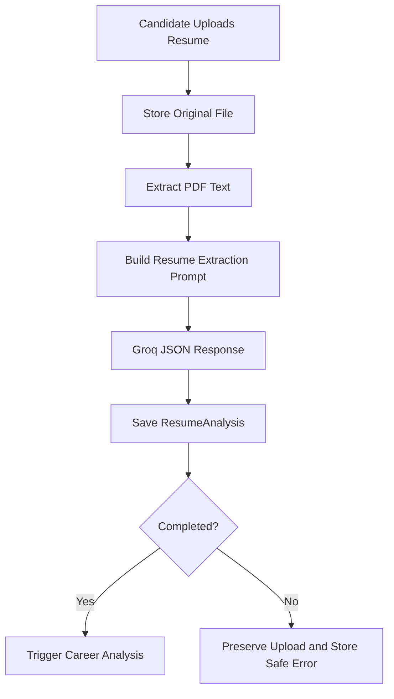
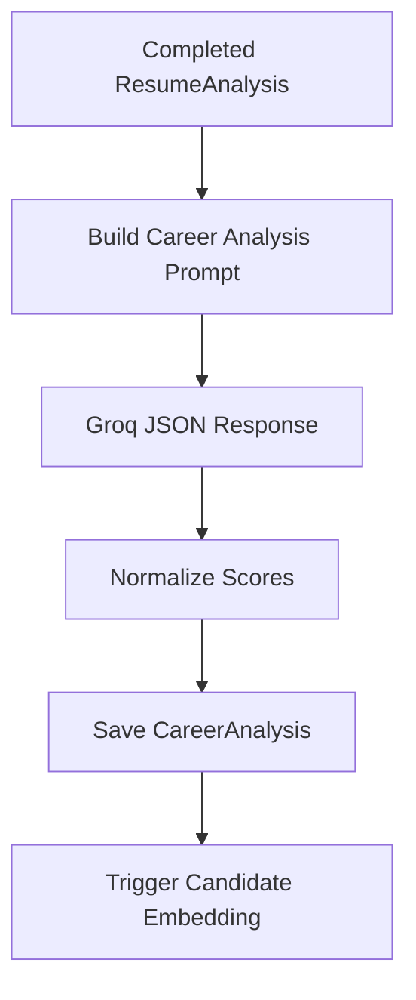
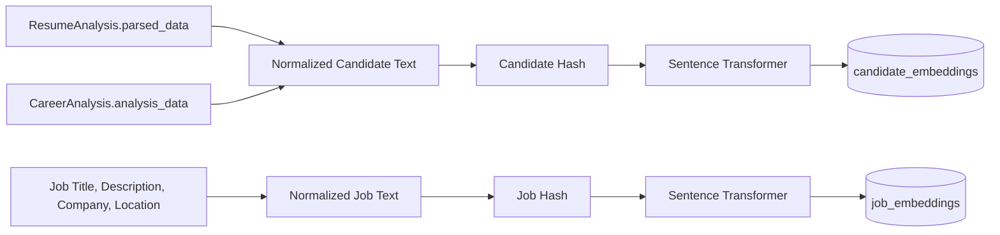
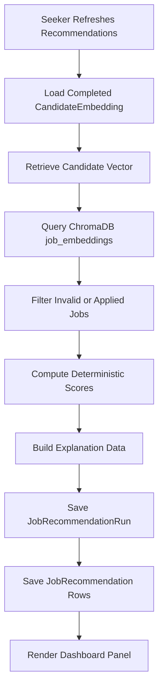

# Architecture

This document describes the current Job Connect AI architecture after the Resume Intelligence, Career Analysis, Embedding Infrastructure, and Semantic Job Matching phases.

## Table of Contents

- [Overall System Architecture](#overall-system-architecture)
- [Django Architecture](#django-architecture)
- [Django App Structure](#django-app-structure)
- [AI Service Layer](#ai-service-layer)
- [Resume Intelligence Flow](#resume-intelligence-flow)
- [Career Analysis Flow](#career-analysis-flow)
- [Embedding Infrastructure](#embedding-infrastructure)
- [Semantic Job Matching Flow](#semantic-job-matching-flow)
- [Failure Handling](#failure-handling)
- [Security Boundaries](#security-boundaries)

## Overall System Architecture

Job Connect AI is a Django monolith organized around one primary app, `jobs`, and one project package, `mysite`.



The project keeps AI business logic in `jobs/services/` so views remain thin wrappers around authentication, request parsing, and response formatting.

## Django Architecture

### Project Package: `mysite`

| File | Responsibility |
| --- | --- |
| `settings.py` | Installed apps, database, static/media, Channels, Groq, embeddings, and ChromaDB configuration |
| `urls.py` | Root URL configuration |
| `asgi.py` | ASGI app used by Daphne and Channels |
| `wsgi.py` | WSGI app for traditional HTTP serving |

### Application Package: `jobs`

| File or Folder | Responsibility |
| --- | --- |
| `models.py` | Domain models for profiles, jobs, applications, saved jobs, chat, resume analysis, career analysis, embeddings, and recommendations |
| `views.py` | Page rendering and JSON endpoints |
| `urls.py` | App URL patterns |
| `decorators.py` | Role-based access guards |
| `forms.py` | Profile and job forms |
| `consumers.py` | WebSocket chat handling |
| `routing.py` | Channels WebSocket route configuration |
| `templates/` | Django templates for public, seeker, employer, and chat screens |
| `services/` | AI, parsing, embedding, vector, and matching logic |

## Django App Structure



## AI Service Layer

The AI service layer is intentionally modular:

```text
jobs/services/
├── groq_client.py                 # Groq API wrapper
├── resume_parser.py               # PDF text extraction
├── resume_prompts.py              # Resume extraction prompts
├── resume_analysis.py             # Resume analysis orchestration
├── career_prompts.py              # Career analysis prompts
├── career_scoring.py              # Deterministic score normalization
├── career_analysis.py             # Career analysis orchestration
├── embedding_client.py            # Sentence Transformer wrapper
├── candidate_embedding.py         # Candidate embedding text and lifecycle
├── job_embedding.py               # Job embedding text and lifecycle
├── vector_store.py                # ChromaDB wrapper
├── job_matching.py                # Semantic matching and reranking
└── recommendation_explanations.py # Deterministic explanation data
```

Key boundaries:

- Views do not call Groq, Sentence Transformers, or ChromaDB directly.
- LLM output is stored separately from uploaded resume files.
- Vectors are not stored in Django models.
- Embedding failures are isolated so core workflows continue.
- Recommendation ranking is deterministic and not delegated to the LLM.

## Resume Intelligence Flow



Privacy design:

- Groq API keys are loaded from environment-backed Django settings.
- The original resume remains stored as a file.
- Parsed structured data lives in `ResumeAnalysis.parsed_data`.
- Missing Groq configuration fails analysis safely without breaking upload.

## Career Analysis Flow



Career analysis depends on structured resume data and does not duplicate resume basics already stored by `ResumeAnalysis`.

## Embedding Infrastructure

Embeddings prepare the platform for semantic AI features without requiring PostgreSQL or external embedding APIs.



### Candidate Embeddings

Input:

- `ResumeAnalysis.parsed_data`
- `CareerAnalysis.analysis_data`

Excluded:

- Raw PDF files
- Full extracted resume text
- Chat history
- Error messages

Storage:

- Vector: ChromaDB collection `candidate_embeddings`
- Metadata: Django `CandidateEmbedding`

### Job Embeddings

Input:

- Job title
- Job description
- Company name
- Location
- Derived required skills

Storage:

- Vector: ChromaDB collection `job_embeddings`
- Metadata: Django `JobEmbedding`

### Hash Strategy

Embedding services compute hashes from normalized source content. If the hash is unchanged, regeneration is skipped. This prevents avoidable Sentence Transformer and ChromaDB work.

## Semantic Job Matching Flow



Final score formula:

```text
final_score =
  semantic_score * 0.45 +
  skills_score * 0.30 +
  readiness_score * 0.15 +
  ats_score * 0.10
```

Recommendation explanations include:

- Matched skills.
- Missing skills.
- Score breakdown.
- Confidence.
- Short summary.
- Next steps.

The LLM is not used to determine ranking.

## Failure Handling

The system is designed so AI failures do not block core marketplace behavior:

- Resume upload succeeds even if Groq is unavailable.
- Job posting succeeds even if embedding generation fails.
- Recommendation refresh creates a failed run with a safe error message if ChromaDB or embeddings are unavailable.
- Dashboard pages continue to render when AI records are missing or failed.

## Security Boundaries

- Seeker-only endpoints check the logged-in user's `UserProfile`.
- Recommendation detail endpoints filter by `user_profile`.
- Employer job management filters by the logged-in employer where ownership matters.
- Raw resume text and embeddings are not returned by recommendation endpoints.
- ChromaDB stores vectors locally and is ignored by Git.
