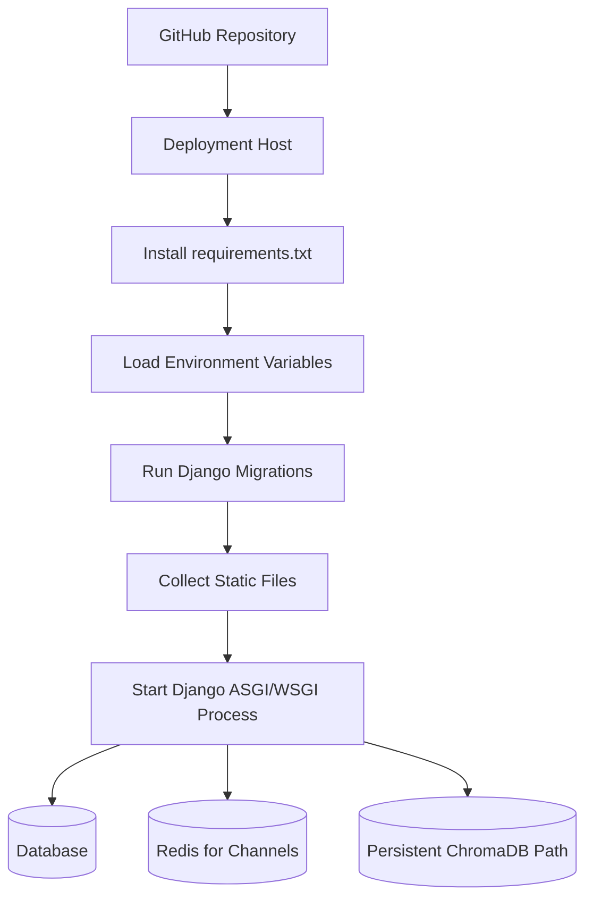

# Deployment Guide

This guide covers local and production deployment considerations for Job Connect AI.

## Table of Contents

- [Environment Variables](#environment-variables)
- [Dependencies](#dependencies)
- [Running Locally](#running-locally)
- [Static and Media Files](#static-and-media-files)
- [Production Deployment](#production-deployment)
- [ChromaDB Notes](#chromadb-notes)
- [Sentence Transformer Notes](#sentence-transformer-notes)
- [Groq Notes](#groq-notes)
- [Database Migrations](#database-migrations)
- [Production Checklist](#production-checklist)

## Environment Variables

Configure these variables in your local shell, `.env` loader, or deployment platform.

| Variable | Required | Example | Notes |
| --- | --- | --- | --- |
| `SECRET_KEY` | Production: yes | `change-me` | Use a long random value in production. Required when `DEBUG=False`. |
| `DEBUG` | Production: yes | `False` | Use `False` for deployed environments. |
| `DATABASE_URL` | Recommended | `postgresql://...` | Falls back to local SQLite if unset. |
| `REDIS_URL` | Production WebSockets | `redis://...` | Used by Channels when configured. Required for reliable multi-process WebSockets. |
| `GROQ_API_KEY` | For AI analysis | `gsk_...` | If missing, uploads should still work but AI analysis fails safely. |
| `GROQ_MODEL` | No | `llama-3.1-8b-instant` | Defaults in settings. |
| `EMBEDDING_MODEL` | No | `all-MiniLM-L6-v2` | Sentence Transformer model name. |
| `CHROMA_DB_PATH` | No | `/app/chroma_db` | Persistent vector store path. |
| `SECURE_SSL_REDIRECT` | Production HTTPS | `True` | Enable when HTTPS is terminated correctly by the host/proxy. |
| `SECURE_HSTS_SECONDS` | Production HTTPS | `31536000` | Enable only after confirming the site is HTTPS-only. |

## Dependencies

Install Python dependencies with:

```bash
pip install -r requirements.txt
```

Important runtime dependencies:

- Django
- Django Channels
- Daphne
- Redis and `channels_redis` for production WebSockets
- WhiteNoise for static files
- Groq SDK
- `pypdf`
- `sentence-transformers`
- ChromaDB

Sentence Transformers may download model files on first use. Plan for network access and startup/runtime disk space in deployment.

## Running Locally

Windows:

```bash
python -m venv venv
venv\Scripts\activate
pip install -r requirements.txt
python manage.py migrate
python manage.py createsuperuser
```

macOS/Linux:

```bash
python3 -m venv venv
source venv/bin/activate
pip install -r requirements.txt
python manage.py migrate
python manage.py createsuperuser
```

For HTTP-only development:

```bash
python manage.py runserver
```

For WebSocket chat:

```bash
daphne -b 127.0.0.1 -p 8000 mysite.asgi:application
```

Run checks:

```bash
python manage.py check
python manage.py test
```

## Static and Media Files

Static files are served with WhiteNoise after collection:

```bash
python manage.py collectstatic --noinput
```

Media files are stored in local filesystem storage by default:

```text
MEDIA_ROOT=./media
```

For production, use persistent disk storage or an external object store if uploaded resumes and chat files must survive redeploys.

## Production Deployment

The repository includes deployment-oriented dependencies and settings, but the target host should be chosen explicitly.

Recommended setup:

1. Create a web service from the GitHub repository on Render, Fly.io, Koyeb, a VPS, or another ASGI-capable host.
2. Add PostgreSQL if production data should not use SQLite.
3. Set `DATABASE_URL` from the production database.
4. Add Redis if WebSocket chat should work reliably across processes or instances.
5. Set `REDIS_URL`.
6. Set `SECRET_KEY`.
7. Set `DEBUG=False`.
8. Set `GROQ_API_KEY` if AI analysis should run.
9. Set `CHROMA_DB_PATH` to a persistent mounted path if available.
10. Run migrations during deploy or through a deployment shell:

```bash
python manage.py migrate
```

11. Collect static files:

```bash
python manage.py collectstatic --noinput
```

The `Procfile` starts the ASGI server only. Run migrations and static collection as separate release/build commands on the deployment platform.

### Suggested Deployment Flow



## ChromaDB Notes

ChromaDB is used as a local persistent vector store.

Default path:

```text
./chroma_db
```

The path is ignored by Git. In production:

- Use a persistent volume if recommendations must survive redeploys.
- Avoid storing ChromaDB inside an ephemeral build directory.
- Keep ChromaDB local files out of source control.
- Back up the Chroma directory if vectors are operationally important.

If ChromaDB fails to initialize, embedding and recommendation operations should fail safely while core job-board flows continue.

## Sentence Transformer Notes

The default embedding model is:

```text
all-MiniLM-L6-v2
```

Operational considerations:

- The model can download on first use.
- Cold starts may be slower when the model is not cached.
- The model cache may need persistent storage in constrained deployment environments.
- If `sentence-transformers` is unavailable, embedding generation should fail safely and update metadata status instead of breaking uploads or job posting.

## Groq Notes

Groq powers structured resume and career analysis.

Operational considerations:

- Never commit `GROQ_API_KEY`.
- Missing or invalid keys should not block resume upload.
- Logs should not include resume text, Groq response bodies, embeddings, or private candidate data.

## Database Migrations

Run migrations after deployment:

```bash
python manage.py migrate
```

Current AI-related models include:

- `ResumeAnalysis`
- `CareerAnalysis`
- `CandidateEmbedding`
- `JobEmbedding`
- `JobRecommendationRun`
- `JobRecommendation`

## Production Checklist

- `DEBUG=False`
- Strong `SECRET_KEY`
- Correct `ALLOWED_HOSTS` and `CSRF_TRUSTED_ORIGINS`
- HTTPS settings configured for the deployment host
- Persistent database configured with `DATABASE_URL`
- Persistent media storage configured
- Redis configured for Channels
- ChromaDB persistent path configured
- Groq key configured only in environment variables
- Static files collected
- Migrations applied
- `python manage.py check` passes
- Smoke-test login, resume upload, job posting, chat, AI analysis, embeddings, and recommendations

## Related Documentation

- [Architecture](architecture.md)
- [API Documentation](api.md)
